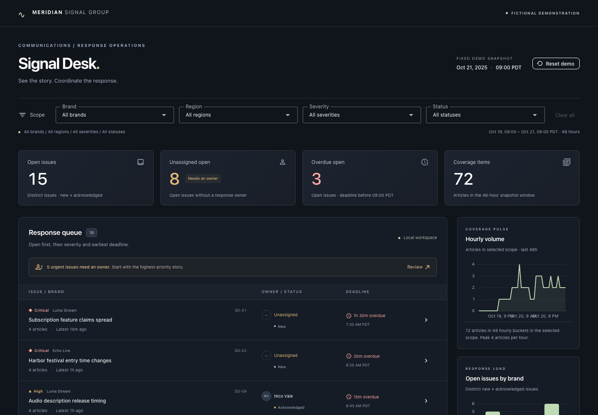

# Signal Desk

A media-response workspace for **Meridian Signal Group**, an entirely fictional organization. Identify an urgent story, inspect its coverage, assign a response owner, acknowledge review, and resolve the issue.

**Publication:** [Public GitHub repository](https://github.com/andy-fitts-slalom/signal-desk). Vercel connection and deployment are user-managed and pending; there is no verified live URL yet. See [deployment handoff](docs/DEPLOYMENT.md).



## Run locally

Use Node.js 22.12 or newer and npm.

```sh
npm ci
npm run dev
```

Open the local URL printed by Vite. This application uses Vue 3, TypeScript, Vite, Vuetify and Apache ECharts. It needs no API keys, environment variables, backend, database, or news connection.

```sh
npm run check       # TypeScript + Vue type checks
npm test            # Domain and dataset unit tests
npm run build       # Production output in dist/
npm run preview     # Serve the production output locally
npx playwright install chromium
npm run test:e2e    # Isolated Chromium browser suite
npm run format      # Format source and documentation
```

Browser tests reserve port 4371 and refuse to reuse an existing process. To check a deployed site, run `PLAYWRIGHT_BASE_URL=https://YOUR-DEPLOYMENT npm run test:e2e`; this skips the local server. Tests only mutate browser-local fictional state.

## Review the workflow

1. Start from the original snapshot: **15 open / 8 unassigned / 3 overdue / 72 articles**.
2. Select **Review** in the queue banner, or open **Subscription feature claims spread** (SD-01), a critical unassigned issue 90 minutes overdue.
3. Inspect the severity explanation and supporting coverage: three original stories, four articles, including one syndicated copy.
4. Select a response owner and **Save owner**. Unassigned open issues becomes 7; status stays New.
5. **Acknowledge** the issue. It remains open. Then **Resolve issue**: open becomes 14 and overdue becomes 2. Coverage remains 72 with all statuses selected.
6. Refresh. Ownership, status and activity survive in this browser. Use **Undo status change**, **Reopen issue**, or confirm **Reset demo** to restore the original dataset.
7. Filter **Folio Press + Asia Pacific** for a useful empty state; **Clear filters** recovers the queue.

## What the numbers mean

- The fixed clock is **October 21, 2025, 09:00 America/Los_Angeles (PDT)**. Ages and deadlines never use the actual current date. Activity is ordered by action sequence at that fixed clock.
- Coverage is limited to the preceding 48 hours. An **issue** groups related reporting; an **article** is one coverage item; an **original story** groups a source report with its syndicated copies.
- There are 18 issues, 72 articles, 54 original stories, 18 syndicated copies, five owners, and three media brands. All are invented.
- A region filter selects articles first. An issue is included if it has at least one matching article, and is counted only once. Brand, severity and status then narrow the issues. Cards, queue and charts use the same scoped selector.
- Open means New or Acknowledged. Overdue means an open issue with a deadline **strictly before** the snapshot; a deadline exactly at the snapshot is Due now. Assignment never changes status.
- Detail shows **all** evidence for its issue and marks articles outside the selected region. Queue article counts, latest-coverage ages and charts use only the selected scope.
- Issue totals are distinct issues; coverage totals are articles. No readership or reach claims are made.

See [data dictionary](docs/DATA.md) for fields and validation.

## Persistence, reset and limits

Changes live in `localStorage` under `signal-desk:v1` on the current origin. They are **not shared team state** and send no email, alerts or external notifications. Different devices, browsers and deployment URLs have separate state. Concurrent tabs are not synchronized; the most recent save wins. Invalid saved state falls back to the seed with a recovery message. A failed save keeps changes in memory and offers **Retry save**. Reset requires confirmation.

The prototype has no authentication, backend, live news feed, real recipients, or real organization data. Keyboard navigation, focus treatment, chart text summaries and reduced-motion support are included. Automated checks are Chromium-based and do not substitute for a full cross-browser or assistive-technology audit. MIT applies to original prototype code; dependencies retain their own licenses.

## Project notes

- [Brief and acceptance criteria](BRIEF.md)
- [Durable session handoff](docs/SESSION.md)
- [Data dictionary](docs/DATA.md)
- [Verification evidence](docs/VERIFICATION.md)
- [Vercel connection instructions](docs/DEPLOYMENT.md)
- [Agent instructions](AGENTS.md)
